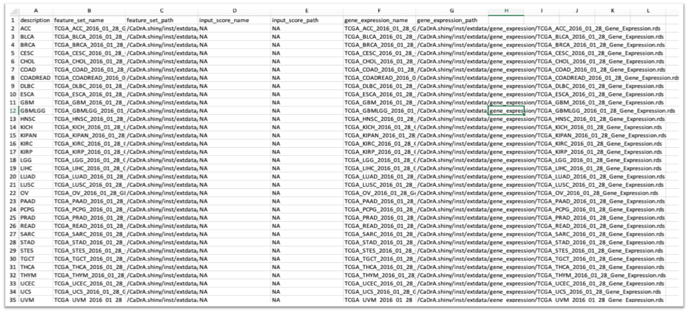

<!-- README.md is generated from README.Rmd. Please edit this file -->

```{r, include=FALSE, echo=FALSE, message=FALSE, warning=FALSE}
knitr::opts_chunk$set(fig.path="./man/figures/", message=FALSE, collapse = TRUE, comment="")
library(knitr)
library(devtools)
load_all()
```

<p style="font-size: 40pt; front-weight: bold; padding-bottom: 0px; margin-bottom: 0;">CaDrA.shiny</p>

<hr style="padding-top: 0; margin-top: 0;">


An R Shiny Dashboard for Interacting with **[CaDrA](https://montilab.github.io/CaDrA/)** Package 

### **Documentation: [https://montilab.github.io/CaDrA/](https://montilab.github.io/CaDrA/)**

### **Web Portal: [https://cadra.bu.edu/](https://cadra.bu.edu/)**

## Overview

**CaDrA-shiny** is an interactive R Shiny dashboard that is developed to allow users to directly interacting with **CaDrA** package. **CaDrA** is an R package that supports a heuristic search framework aimed at identifying candidate drivers of a molecular phenotype of interest (visit [our Github repo](https://github.com/montilab/CaDrA) for more details). 

The CaDrA's shiny dashboard has two distinctive features:

1. Run **CaDrA** search to identify candidate drivers of a molecular phenotype of interest
2. Run **GSVA** to obtain relative enrichment scores for a given gene sets, then subsequently, these scores are used to run **CaDrA** search to look for complementary features that likely driving the input of molecular phenotype. 

Data visualization includes:

- Meta-feature plot 
- Kolmogorov Smirnov (KS) enrichment plot
- Top N candidates overlapping heatmap
- Permutation plot 

The **CaDrA.shiny** package is already containerized using **Docker** and can be deployed on any Cloud-based services.

#### **Docker image: [montilab/cadra-shiny](https://hub.docker.com/r/montilab/cadra-shiny)**

####  Useful Guides

- <a href="articles/docker.html" target="_blank">Containerizing CaDrA.shiny with Docker</a>
- <a href="articles/docker-compose.html" target="_blank">Launching CaDrA's Shiny Dashboard with Compose</a>

### (1) Installation

```r
library(devtools)
devtools::install_github("montilab/CaDrA.shiny")
```

### (2) Load packages

```r
library(CaDrA.shiny)
library(knitr)
```

### (3) Launch CaDrA's Shiny App with dataset included in the package

```r
app <- CaDrA.shiny::CaDrA_App(id="myapp")

# Launch app on localhost with port 3838
shiny::runApp(app, host='0.0.0.0', port=3838)
```

### (4) Launch CaDrA's Shiny App with your pre-proccessed dataset

**Required:** 
a data frame or data file (in **csv** or **rds** format) that includes paths to your pre-proccessed dataset with required columns:

- feature_set_name
- feature_set_path
- input_score_name
- input_score_path
- gene_expression_name
- gene_expression_path

Here is an example of **mydatafile.csv**
<a href="man/figures/datalist.png" target="_blank"></a>

To launch the app:
```r
# Read in the data file that includes paths to your pre-proccessed dataset
mydatafile <- read.csv('/path/to/mydatafile.csv', header=TRUE)

# Launch CaDrA's Shiny app with your loaded data file
app <- CaDrA.shiny::CaDrA_App(id="myapp", datalist_file=mydatafile)

# Launch app on localhost with port 3838
shiny::runApp(app, host='0.0.0.0', port=3838)
```

### (6) Launch CaDrA's Shiny App with dataset downloaded from our web portal using our REST API

#### (i) Retrieve a list of pre-processed feature sets available on the portal

```{r}
# API server to get a list of feature sets in the CaDrA Portal
API_Server <- "https://montilab.bu.edu/CaDrA_API/get_feature_set"

# Get a list of feature sets available on CaDrA Portal
fs_list <- CaDrA.shiny::get_feature_set(API_Server, order_by="asc")
```

```{r}
# Look at the first 6 feature sets
knitr::kable(head(fs_list))
```

#### (ii) Download pre-processed feature sets using our REST API

```{r}
# Download the feature sets along with its input score and gene expression
API_Server <- paste0("https://montilab.bu.edu/CaDrA_API/download_feature_set") 

# Retrieve first two feature sets received from (i)
# e.g., TCGA_ACC_2016_01_28_GISTIC_MUT_SIG, TCGA_BLCA_2016_01_28_GISTIC_MUT_SIG
feature_sets <- fs_list$feature_set_name
include_input_score <- TRUE
include_gene_expression <- TRUE
out_dir <- "~/Github"

# Download feature sets and return a datalist with appropriate paths to dataset
mydatafile <- CaDrA.shiny::download_feature_sets(
  API_Server = API_Server,
  feature_sets = feature_sets,
  include_input_score = include_input_score,
  include_gene_expression = include_gene_expression,
  out_dir = out_dir
)
```

```{r}
# Look at the top 6 rows
knitr::kable(head(mydatafile))
```

#### (iii) Launch CaDrA's app with the downloaded dataset

```r
# Launch CaDrA's Shiny app with your downloaded datalist retrieved from (ii)
app <- CaDrA.shiny::CaDrA_App(id="myapp", datalist=mydatafile)

# Launch app on localhost with port 3838
shiny::runApp(app, host='0.0.0.0', port=3838)
```

# A Glimpse of CaDrA's Dashboard

There are five tabs on CaDrA's Dashboard. Explore each tab and see what they do:


- <a href="articles/run-cadra-tab.html" target="_blank">Run CaDrA</a>
- <a href="articles/run-gsva-tab.html" target="_blank">Run GSVA</a>
- <a href="articles/api.html" target="_blank">Dataset</a>
- Help
- Publication
- Contract Us

# Getting Help

To get help with **CaDrA**, visit our [Github dicussion](https://github.com/montilab/CaDrA/discussions) or [Github issues](https://github.com/montilab/CaDrA/issues).

To get help with **CaDrA.shiny**, visit our [Github dicussion](https://github.com/montilab/CaDrA.shiny/discussions) or [Github issues](https://github.com/montilab/CaDrA.shiny/issues).


