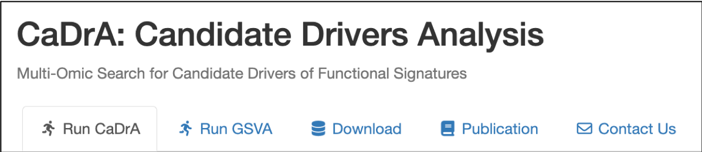

<!-- README.md is generated from README.Rmd. Please edit this file -->

<script src='https://cdn.jsdelivr.net/gh/eddymens/markdown-external-link-script@v1.0.0/main.min.js'></script>

```{r, include=FALSE, echo=FALSE, message=FALSE, warning=FALSE}
knitr::opts_chunk$set(fig.path="./man/figures/", message=FALSE, collapse = TRUE, comment="")
library(SummarizedExperiment)
library(CaDrA)
library(devtools)
load_all()
```

<p style="font-size: 40pt; front-weight: bold; padding-bottom: 0px; margin-bottom: 0;">CaDrA.shiny</p>

<hr style="padding-top: 0; margin-top: 0;">


An R Shiny Dashboard for Interacting with **[CaDrA](https://montilab.github.io/CaDrA/)** Package 

### **Documentation: [https://montilab.github.io/CaDrA/](https://montilab.github.io/CaDrA/)**

### **Web Portal: [https://cadra.bu.edu/](https://cadra.bu.edu/)**

## Overview

**CaDrA-shiny** is an interactive R Shiny dashboard that was developed to allow users to directly interacting with **CaDrA** package. **CaDrA** is an R package that supports a heuristic search framework aimed at identifying candidate drivers of a molecular phenotype of interest (visit [our Github repo](https://github.com/montilab/CaDrA) for more details). 

The CaDrA's shiny dashboard has two distinctive features:

1. Run **CaDrA** search to identify candidate drivers of a molecular phenotype of interest
2. Run **GSVA** to obtain relative enrichment scores for a given gene sets, then subsequently, these scores are used to run **CaDrA** search to look for complementary features that likely driving the input of molecular phenotype. 

Data visualization includes:

- Meta-feature plot 
- Kolmogorov Smirnov (KS) enrichment plot
- Top N candidates overlapping heatmap
- Permutation-based testing plot 

The **CaDrA.shiny** package is already containerized using **Docker** and can be deployed on any Cloud-based services.

#### **Docker image: [montilab/cadra-shiny](https://hub.docker.com/r/montilab/cadra-shiny)**

# Run CaDrA Shiny App on RStudio Desktop

Don't have RStudio Desktop installed, download [here](https://posit.co/download/rstudio-desktop/).

### (1) Installation

```r
library(devtools)
devtools::install_github("montilab/CaDrA.shiny")
```

### (2) Load packages

```r
library(CaDrA.shiny)
```

### (3) Launch CaDrA's Shiny App with dataset included in the package

```r
CaDrA.shiny::CaDrA_App(id="myapp")
```

### (4) Launch CaDrA's Shiny App with your pre-proccessed dataset

**Required:** 
a data file (in **csv** or **rds** format) that includes paths to your pre-proccessed dataset with the following column fields populated:

- feature_set_names
- feature_set_paths
- input_score_names
- input_score_paths
- gene_expression_names
- gene_expression_paths

Here is an example of **mydatafile.csv**:


To launch the app:
```r
# Read in the data file that includes paths to your pre-proccessed dataset
mydatafile <- read.csv('/path/to/mydatafile.csv', header=TRUE)

# Launch CaDrA's Shiny app with your loaded data file
CaDrA.shiny::CaDrA_App(id="myapp", datalist_file=mydatafile)
```

### (6) Launch CaDrA's Shiny App with dataset download from our API portal

#### (i) Retrieve pre-processed dataset from API

```r
# Read in the data file that includes paths to your pre-proccessed dataset
mydatafile <- read.csv('/path/to/mydatafile.csv', header=TRUE)

# Launch CaDrA's Shiny app with your loaded data file
CaDrA.shiny::CaDrA_App(id="myapp", datalist_file=mydatafile)
```

#### (ii) Launch CaDrA's app with downloaded dataset

```r
# Read in the data file that includes paths to your pre-proccessed dataset
mydatafile <- read.csv('/path/to/mydatafile.csv', header=TRUE)

# Launch CaDrA's Shiny app with your loaded data file
CaDrA.shiny::CaDrA_App(id="myapp", datalist_file=mydatafile)
```

# A Glimpse of CaDrA's Dashboard

There are five tabs on CaDrA's Dashboard. Explore each tab and see what they do:



- <a href="articles/run-cadra-tab.html" target="_blank">Run CaDrA</a>
- <a href="articles/run-gsva-tab.html" target="_blank">Run GSVA</a>
- <a href="articles/dataset-tab.html" target="_blank">Dataset</a>
- Help
- Publication
- Contract Us

# User Guide:

- [Containerizing CaDrA.shiny with Docker](https://montilab.github.io/CaDrA/articles/docker.html)
- [Launch CaDrA Shiny with Compose](https://montilab.github.io/CaDrA/articles/docker-compose.html)
- [Getting started with CaDrA's Shiny Dashboard](https://montilab.github.io/CaDrA/articles/getting-started.html)

# Getting Help

See our **User Guide** for more complete documentation of **CaDrA.shiny**

To get help with **CaDrA**, visit our [Github dicussion](https://github.com/montilab/CaDrA/discussions) or [Github issues](https://github.com/montilab/CaDrA/issues).

To get help with **CaDrA.shiny**, visit our the [Github dicussion](https://github.com/montilab/CaDrA.shiny/discussions) or [Github issues](https://github.com/montilab/CaDrA.shiny/issues).


