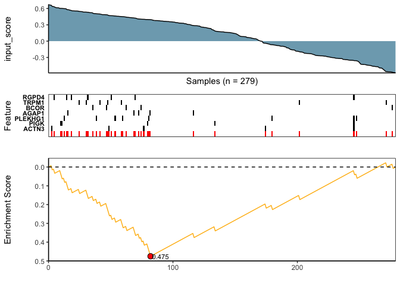
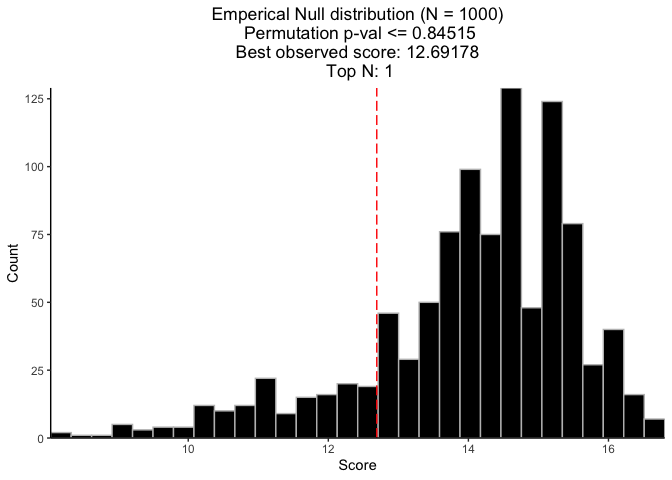
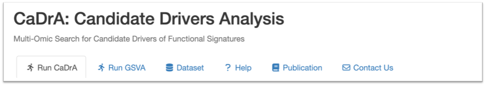

<!-- README.md is generated from README.Rmd. Please edit this file -->
<p style="font-size: 40pt; front-weight: bold; padding-bottom: 0px; margin-bottom: 0;">
CaDrA.shiny
</p>
<hr style="padding-top: 0; margin-top: 0;">


An R Shiny Dashboard for Interacting with
**[CaDrA](https://montilab.github.io/CaDrA/)** Package

### **CaDrA Package: <https://montilab.github.io/CaDrA/>**

### **Web Portal: <https://cadra.bu.edu/>**

## Overview

**CaDrA-shiny** is an interactive R Shiny dashboard developed to allow
users to directly interact with the **CaDrA** package. **CaDrA** is an R
package that supports a heuristic search framework aimed at identifying
candidate drivers of a molecular phenotype of interest (visit [our
Github repo](https://github.com/montilab/CaDrA) for more details).

The CaDrA’s shiny dashboard has two distinctive features:

1.  Run **CaDrA** search to identify candidate drivers of a molecular
    phenotype of interest.
2.  Run **GSVA** to estimate aggregate enrichment scores by projecting a
    (gene) expression dataset onto a given gene set or signature,
    usually representing a molecular phenotype.

Data visualizations include:

- Meta-feature plot.
- Kolmogorov Smirnov (KS) enrichment plot.
- Top N candidates overlapping heatmap.
- Permutation plot.

The **CaDrA.shiny** package is already containerized using **Docker**
and can be deployed on any Cloud-based services.

#### **Docker image: [montilab/cadra-shiny](https://hub.docker.com/r/montilab/cadra-shiny)**

#### Useful Guides

- <a href="articles/docker.html" target="_blank">Containerize
  CaDrA.shiny with Docker</a>
- <a href="articles/docker-compose.html" target="_blank">Launch CaDrA’s
  Shiny Dashboard with Compose</a>

### (1) Installation

``` r
# Install BiocManager
if (!require("BiocManager", quietly = TRUE))
  install.packages("BiocManager")

# Install CaDrA 
BiocManager::install("CaDrA")

# Install GSVA 
BiocManager::install("GSVA")

# Install hypeR
library(devtools)
devtools::install_github("montilab/hypeR")

# Install CaDrA.shiny
devtools::install_github("montilab/CaDrA.shiny")

# Install knitr
install.packages("knitr", repos="http://cran.us.r-project.org")
```

### (2) Load packages

``` r
library(CaDrA.shiny)
library(CaDrA)
library(GSVA)
library(hypeR)
library(knitr)
```

### (3) Run CaDrA with dataset downloaded from CaDrA Portal

Here, we show how to run CaDrA on a dataset downloaded from the CaDrA
Portal, using input_score’s derived by applying GSVA to the downloaded
gene expression dataset and the
[Hallmarks](https://www.gsea-msigdb.org/gsea/msigdb/human/genesets.jsp?collection=H)
genesets. We will run a CaDrA search to look for genetic drivers of the
*“Epithelial Mesenchymal Transition”* (EMT)-derived score.

#### (i) Retrieve a list of descriptors of pre-processed feature sets available on the portal

``` r
## Get a list of descriptors of feature sets available on CaDrA Portal
fs_list <- CaDrA.shiny::get_feature_set(order_by="asc")
```

``` r
## Show the description of the first few feature sets
knitr::kable(head(fs_list), row.names = FALSE)
```

<table>
<thead>
<tr>
<th style="text-align:left;">
feature_set_name
</th>
<th style="text-align:left;">
description
</th>
<th style="text-align:left;">
collection
</th>
</tr>
</thead>
<tbody>
<tr>
<td style="text-align:left;">
CCLE SCNAs and Mutations
</td>
<td style="text-align:left;">
Somatic copy number alterations and mutations from CCLE. See
?CaDrA::CCLE_MUT_SCNA
</td>
<td style="text-align:left;">
CCLE
</td>
</tr>
<tr>
<td style="text-align:left;">
Simulated Feature Set
</td>
<td style="text-align:left;">
Simulated feature set comprises of 1000 genomic features and 100 sample
profiles. This simulated data includes 10 left-skewed (i.e. True
Positive or TP) and 990 uniformly-distributed (i.e. True Null or TN)
features. See ?CaDrA::BRCA_GISTIC_MUT_SIG
</td>
<td style="text-align:left;">
Simulated
</td>
</tr>
<tr>
<td style="text-align:left;">
TCGA BrCa SCNAs and Mutations
</td>
<td style="text-align:left;">
Somatic copy number alterations and mutations from BRCA TCGA. See
?CaDrA::BRCA_GISTIC_MUT_SIG
</td>
<td style="text-align:left;">
TCGA
</td>
</tr>
<tr>
<td style="text-align:left;">
TCGA_ACC_2016_01_28_GISTIC_MUT_SIG
</td>
<td style="text-align:left;">
ACC
</td>
<td style="text-align:left;">
TCGA
</td>
</tr>
<tr>
<td style="text-align:left;">
TCGA_BLCA_2016_01_28_GISTIC_MUT_SIG
</td>
<td style="text-align:left;">
BLCA
</td>
<td style="text-align:left;">
TCGA
</td>
</tr>
<tr>
<td style="text-align:left;">
TCGA_BRCA_2016_01_28_GISTIC_MUT_SIG
</td>
<td style="text-align:left;">
BRCA
</td>
<td style="text-align:left;">
TCGA
</td>
</tr>
</tbody>
</table>

#### (ii) Retrieve datasets from the portal

``` r
## Retrieve the ACC dataset (both genetic feature set and gene expression)
datasets <- CaDrA.shiny::pull_datasets(
  feature_set = "TCGA_HNSC_2016_01_28_GISTIC_MUT_SIG",
  include_gene_expression = TRUE
)
datasets
```

    $feature_set
    class: RangedSummarizedExperiment 
    dim: 12852 279 
    metadata(3): experimentData annotation protocolData
    assays(1): exprs
    rownames(12852): Amp2q11.2 Amp2q31.2 ... ZZEF1 ZZZ3
    rowData names(1): Feature
    colnames(279): TCGA-BA-4074-01 TCGA-BA-4076-01 ... TCGA-IQ-7631-01
      TCGA-IQ-7632-01
    colData names(0):

    $gene_expression
    class: RangedSummarizedExperiment 
    dim: 20234 566 
    metadata(3): experimentData annotation protocolData
    assays(1): exprs
    rownames(20234): SMR3B STATH ... SCARNA27 MS4A5
    rowData names(1): Genes
    colnames(566): TCGA-4P-AA8J-01 TCGA-BA-4074-01 ... TCGA-WA-A7GZ-01
      TCGA-WA-A7H4-01
    colData names(1): Samples

#### (iii) Run GSVA on the downloaded expression dataset

``` r
## download MSigDB’s Hallmark genesets
hallmarks <- hypeR::msigdb_gsets("Homo sapiens", "H", clean=TRUE)$genesets # returns 50 genesets 

# Compute the gsva scores of the 50 hallmark genesets
input_score_matrix <- GSVA::gsva(
  expr = SummarizedExperiment::assay(datasets$gene_expression), 
  gset.idx.list = hallmarks,
  method = "gsva",
  mx.diff = TRUE,
  verbose = FALSE
)
```

``` r
## Show few entries of the returned hallmark-by-sample matrix
knitr::kable(input_score_matrix[1:5, 1:5])
```

<table>
<thead>
<tr>
<th style="text-align:left;">
</th>
<th style="text-align:right;">
TCGA-4P-AA8J-01
</th>
<th style="text-align:right;">
TCGA-BA-4074-01
</th>
<th style="text-align:right;">
TCGA-BA-4075-01
</th>
<th style="text-align:right;">
TCGA-BA-4076-01
</th>
<th style="text-align:right;">
TCGA-BA-4077-01
</th>
</tr>
</thead>
<tbody>
<tr>
<td style="text-align:left;">
Adipogenesis
</td>
<td style="text-align:right;">
-0.0160921
</td>
<td style="text-align:right;">
0.1648353
</td>
<td style="text-align:right;">
0.2211107
</td>
<td style="text-align:right;">
-0.0737085
</td>
<td style="text-align:right;">
-0.0115116
</td>
</tr>
<tr>
<td style="text-align:left;">
Allograft Rejection
</td>
<td style="text-align:right;">
-0.0049091
</td>
<td style="text-align:right;">
-0.0081298
</td>
<td style="text-align:right;">
-0.0447976
</td>
<td style="text-align:right;">
-0.3880485
</td>
<td style="text-align:right;">
0.4610353
</td>
</tr>
<tr>
<td style="text-align:left;">
Androgen Response
</td>
<td style="text-align:right;">
-0.3956958
</td>
<td style="text-align:right;">
0.0941687
</td>
<td style="text-align:right;">
0.1397883
</td>
<td style="text-align:right;">
0.1266452
</td>
<td style="text-align:right;">
0.2823991
</td>
</tr>
<tr>
<td style="text-align:left;">
Angiogenesis
</td>
<td style="text-align:right;">
0.3141972
</td>
<td style="text-align:right;">
0.2880628
</td>
<td style="text-align:right;">
0.3441984
</td>
<td style="text-align:right;">
-0.1819343
</td>
<td style="text-align:right;">
0.0226343
</td>
</tr>
<tr>
<td style="text-align:left;">
Apical Junction
</td>
<td style="text-align:right;">
0.1902571
</td>
<td style="text-align:right;">
-0.2399212
</td>
<td style="text-align:right;">
-0.1048696
</td>
<td style="text-align:right;">
-0.0193586
</td>
<td style="text-align:right;">
0.1687033
</td>
</tr>
</tbody>
</table>

#### (iv) Run candidate search with input scores obtained in (iii)

``` r
## Samples to keep based on the overlap between the two inputs
sample_overlap <- intersect(colnames(input_score_matrix), colnames(datasets$feature_set))
input_score <- input_score_matrix["Epithelial Mesenchymal Transition", sample_overlap]
FS <- datasets$feature_set[, sample_overlap, drop = FALSE]

## Pre-filter FS based on occurrence frequency
FS_filtered <- CaDrA::prefilter_data(
  FS = FS,
  max_cutoff = 0.6,  # max event frequency (60%)
  min_cutoff = round(5/ncol(FS), 2)  # make sure min event frequency has at least 5 samples 
)  

## Run candidate search
topn_result <- CaDrA::candidate_search(
  FS = FS_filtered,
  input_score = input_score,
  method = "ks_pval",          # Use Kolmogorov-Smirnov scoring function 
  method_alternative = "less", # Use one-sided hypothesis testing
  weights = NULL,              # If weights are provided, perform a weighted-KS (gsea-like) test
  search_method = "both",      # Apply both forward and backward search
  top_N = 1,                   # Perform only one search (starting from top scoring feature)
  max_size = 7,                # Maximum number of features to include in the returned meta-feature
  do_plot = FALSE,             # Plot after finding the best features
  best_score_only = FALSE      # Return all results from the search
)
```

### (v) Visualize Best Results

``` r
## Fetch the meta-feature yielding the best score over N searches
## .. (in this example, only N=1 search was performed)
topn_best_meta <- CaDrA::topn_best(topn_result)

## Visualize the best results with the meta-feature plot
CaDrA::meta_plot(topn_best_list = topn_best_meta, input_score_label = NULL)
```

<!-- -->

### (vi) Compute permutation-based p-value

``` r
## Permutation seed (for reproducible results)
set.seed(123)

## Run CaDrA Search 100 times on permuted input scores to estimate the null distribution
perm_res <- CaDrA::CaDrA(
  FS = FS_filtered, 
  input_score = input_score, 
  method = "ks_pval",
  method_alternative = "less",
  top_N = 1,
  max_size = 7,
  search_method = "both",     
  n_perm = 100,
  perm_alternative = "one.sided",
  ncores = 2,
  cache = FALSE
)

## Visualize permutation results
CaDrA::permutation_plot(perm_res = perm_res)
```

<!-- -->

### (4) Launch CaDrA’s Shiny App with your pre-proccessed dataset

Here, we show how to launch a local instance of the CaDrA Portal, which
will be populated with a user-selected set of datasets. In the example,
a single dataset (ACC) will be uploaded to the portal.

#### (i) Pull pre-processed feature sets using our REST API

``` r
# Download feature sets and return a datalist with appropriate paths to dataset
mydatafile <- CaDrA.shiny::download_feature_sets(
  #feature_set = fs_list$feature_set_name,  # this would download all TCGA datasets
  feature_set = "TCGA_ACC_2016_01_28_GISTIC_MUT_SIG",
  include_input_score = TRUE,
  include_gene_expression = TRUE,
  out_dir = file.path(Sys.getenv("HOME"), "Github") # specify your folder of choice here
)
```

``` r
# Look at the top 6 rows
knitr::kable(head(mydatafile), row.names = FALSE)
```

<table>
<thead>
<tr>
<th style="text-align:left;">
feature_set_name
</th>
<th style="text-align:left;">
feature_set_path
</th>
<th style="text-align:left;">
input_score_name
</th>
<th style="text-align:left;">
input_score_path
</th>
<th style="text-align:left;">
gene_expression_name
</th>
<th style="text-align:left;">
gene_expression_path
</th>
</tr>
</thead>
<tbody>
<tr>
<td style="text-align:left;">
TCGA_ACC_2016_01_28_GISTIC_MUT_SIG
</td>
<td style="text-align:left;">
/Users/reinachau/Github/download-fs-2023-11-07/TCGA_ACC_2016_01_28_GISTIC_MUT_SIG/feature_set/TCGA_ACC_2016_01_28_GISTIC_MUT_SIG.rds
</td>
<td style="text-align:left;">
NA
</td>
<td style="text-align:left;">
/Users/reinachau/Github/download-fs-2023-11-07/TCGA_ACC_2016_01_28_GISTIC_MUT_SIG/input_score/NA
</td>
<td style="text-align:left;">
TCGA_ACC_2016_01_28_Gene_Expression
</td>
<td style="text-align:left;">
/Users/reinachau/Github/download-fs-2023-11-07/TCGA_ACC_2016_01_28_GISTIC_MUT_SIG/gene_expression/TCGA_ACC_2016_01_28_Gene_Expression.rds
</td>
</tr>
<tr>
<td style="text-align:left;">
TCGA_ACC_2016_01_28_GISTIC_MUT_SIG
</td>
<td style="text-align:left;">
/Users/reinachau/Github/download-fs-2023-11-07/TCGA_ACC_2016_01_28_GISTIC_MUT_SIG/feature_set/TCGA_ACC_2016_01_28_GISTIC_MUT_SIG.rds
</td>
<td style="text-align:left;">
NA
</td>
<td style="text-align:left;">
/Users/reinachau/Github/download-fs-2023-11-07/TCGA_ACC_2016_01_28_GISTIC_MUT_SIG/input_score/NA
</td>
<td style="text-align:left;">
TCGA_ACC_2016_01_28_Gene_Expression
</td>
<td style="text-align:left;">
/Users/reinachau/Github/download-fs-2023-11-07/TCGA_ACC_2016_01_28_GISTIC_MUT_SIG/gene_expression/TCGA_ACC_2016_01_28_Gene_Expression.rds
</td>
</tr>
</tbody>
</table>

#### (iii) Launch CaDrA’s Shiny app with the downloaded dataset

``` r
## Launch CaDrA's Shiny app with your downloaded datalist retrieved from (ii)
app <- CaDrA.shiny::CaDrA_App(id="myapp", datalist=mydatafile)

## Launch app on localhost with port 3838
shiny::runApp(app, host='0.0.0.0', port=3838)
```

# A Glimpse of CaDrA’s Dashboard

There are five tabs on CaDrA’s Dashboard. Explore each tab and see what
they do:



- <a href="articles/run-cadra-tab.html" target="_blank">Run CaDrA</a>
- <a href="articles/run-gsva-tab.html" target="_blank">Run GSVA</a>
- <a href="articles/api.html" target="_blank">Download</a>
- Help
- Publication
- Contract Us

# Getting Help

To get help with **CaDrA**, visit our [Github
dicussion](https://github.com/montilab/CaDrA/discussions) or [Github
issues](https://github.com/montilab/CaDrA/issues).

To get help with **CaDrA.shiny**, visit our [Github
dicussion](https://github.com/montilab/CaDrA.shiny/discussions) or
[Github issues](https://github.com/montilab/CaDrA.shiny/issues).
