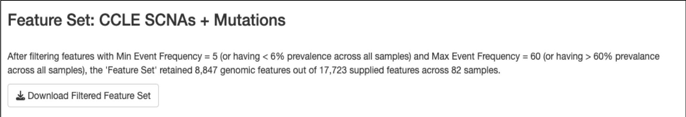
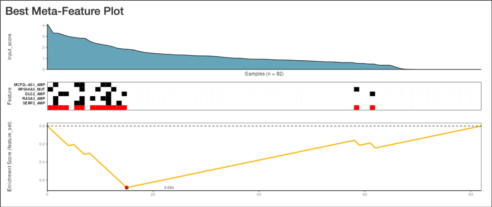

<!-- README.md is generated from README.Rmd. Please edit this file -->

# CaDrA.shiny


An R Shiny Dashboard for Interacting with CaDrA package

## **Documentation: <https://montilab.github.io/CaDrA/>**

## **Web Portal: <https://cadra.bu.edu/>**

## Overview

**CaDrA-shiny** is an interactive Shiny dashboard that was developed to
allow users to directly interacting with **CaDrA** package. **CaDrA** is
an R package that supports a heuristic search framework aimed at
identifying candidate drivers of a molecular phenotype of interest
(visit [our Github repo](https://github.com/montilab/CaDrA) for more
details).

The CaDrA shiny dashboard has two distinctive features:

1.  Run **CaDrA** to search for candidate drivers of a molecular
    phenotype of interest
2.  Run **GSVA** to obtain the relative enrichment scores for a given
    gene sets, then subsequently, these scores are used to run **CaDrA**
    to identify complementary features that likely driving the input of
    molecular phenotype.

Data visualization includes:

- Meta-feature plot
- KS enrichment plot
- Top N candidates overlapping heatmap
- Permutation-based testing plot

The **CaDrA.shiny** package is containerized using **Docker** and can be
deployed on any Cloud-based services.

**Docker Image:
[montilab/cadra-shiny](https://hub.docker.com/r/montilab/cadra-shiny)**

# Run CaDrA Shiny App on RStudio Desktop

Don’t have RStudio Desktop installed, download
[here](https://posit.co/download/rstudio-desktop/).

### (1) Installation

``` r
library(devtools)
devtools::install_github("montilab/CaDrA.shiny")
```

### (2) Load packages

``` r
library(CaDrA.shiny)
```

### (3) Launch CaDrA Shiny App with dataset included in the package

``` r
CaDrA.shiny::CaDrA_App(id="myapp")
```

### (4) Launch CaDrA Shiny App with your provided dataset

``` r

# Read in your data file. Assume your datafile is stored as csv format
mydatafile <- read.csv('/path/to/mydatafile.csv', header=TRUE)

# Lauch CaDrA Shiny app with your provided data file
CaDrA.shiny::CaDrA_App(id="myapp", datalist_file=mydatafile)
```

### (5) A Glimpse of CaDrA’s Dashboard

#### (i) User Inputs


#### (ii) CaDrA Results







## Getting Help

See User Guide for more complete documention of all of CaDrA.shiny’s
features.

To get help with CaDrA or CaDrA.shiny, please use the [Github
dicussion](https://github.com/montilab/CaDrA/discussions) or [Github
issues](https://github.com/montilab/CaDrA/issues).
