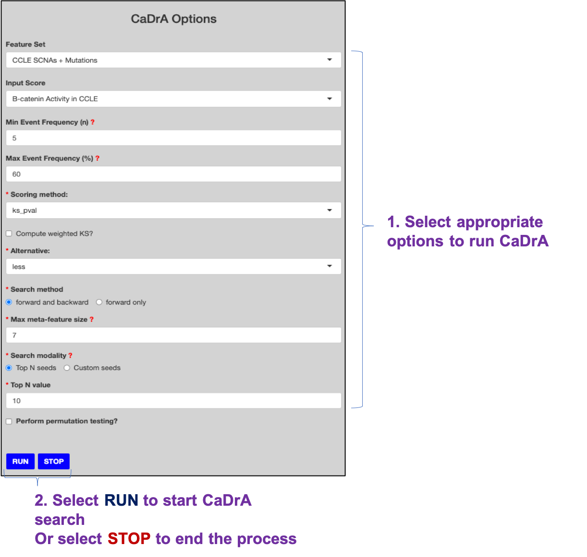

```{r, include=FALSE, messages=FALSE, warnings=FALSE}
knitr::opts_chunk$set(message=FALSE, collapse = TRUE, comment="")
```


There are two panels on this page:

- Left-side: [User Inputs](#user-inputs)
- Right-side: [CaDrA Results](#cadra-results)

## 1. User Inputs



## 2. CaDrA Results

There are several results returned from running **CaDrA** search:

- Filtered feature set based on given filtered parameters
- Provided observed input scores
- Best meta-feature set was identified from the heuristic search 
- Meta-plot shows complementary features with their overlapping union and its enrichment score
- Overlapping heatmap shows best-features returned from repeating the search with top N features


