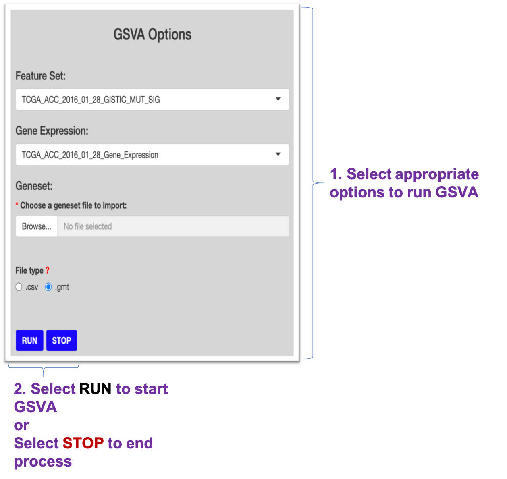
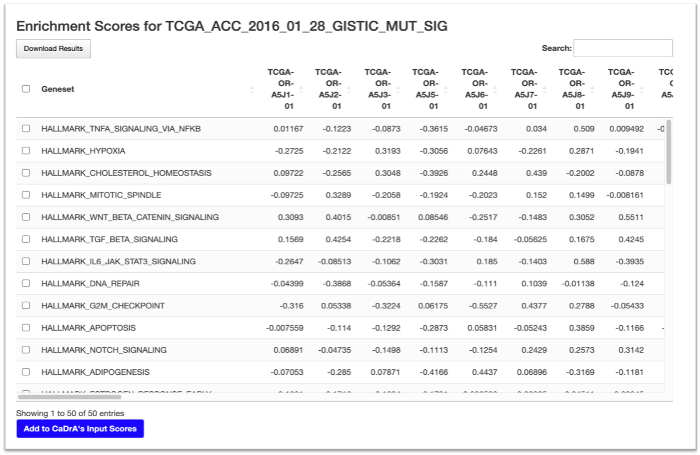

```{r, include=FALSE, messages=FALSE, warnings=FALSE}
knitr::opts_chunk$set(message=FALSE, collapse = TRUE, comment="")
```

<h1 style="text-align: center; color: #8B008B; font-weight: bold;">Instructions</h1>


There are two panels on this page:

- Right-side: [User Inputs](#user-inputs)
- Left-side: [GSVA Results](#gsva-results)

## 1. User Inputs



## 2. GSVA Results



