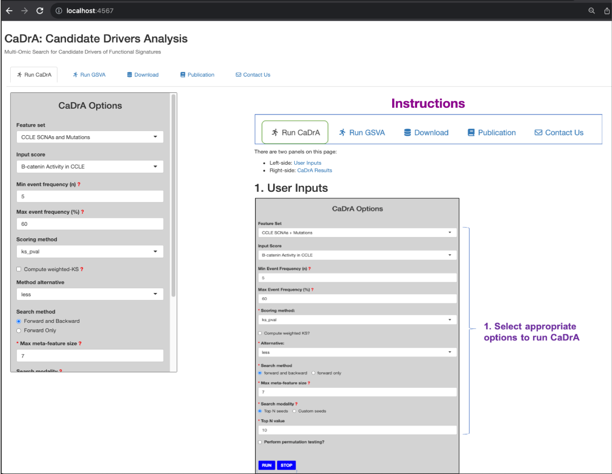

```{r, include=FALSE, messages=FALSE, warnings=FALSE}
knitr::opts_chunk$set(message=FALSE, collapse = TRUE, comment="")

# Load CaDrA and CaDrA.shiny
library(devtools)
devtools::load_all("~/Github/CaDrA", recompile=TRUE)
devtools::load_all("~/Github/CaDrA.shiny", recompile=TRUE)

# Load other R packages
library(tidyverse)
```

## Software requirements

- Git version >= 2.21
- Docker version >= 20.10

Don't have Git installed, see [Git Guides](https://github.com/git-guides/install-git)

Don't have Docker installed, see [Docker Engine](https://docs.docker.com/engine/install/)

## Build Docker image of `CaDrA.shiny`

### (1) Clone this repository

```bash
cd /path/to/
git clone https://github.com/montilab/CaDrA.shiny.git
``` 

### (2) Navigate to `CaDrA.shiny` folder where `Dockerfile` is stored and build its Docker image. 

```bash
cd /path/to/CaDrA.shiny/
docker build -t cadra.shiny:latest .
```
**`-t`**: add a tag to an image such as the version of the application, e.g. *cadra.shiny:1.0.0* or *cadra.shiny:latest*. <br>

### (3) After the build is completed, check if the image is built successfully

```bash
docker images

REPOSITORY        TAG        IMAGE ID        CREATED        SIZE
cadra.shiny       latest     2c22887402d3    2 hours ago    2.56GB
```

## Run `CaDrA.shiny` container with its built image

### (1) Mount appropriate data inputs and code base to the container

```bash    
docker run \
-v /path/to/CaDrA.shiny:/CaDrA.shiny \
-v /path/to/CaDrA.shiny/inst/extdata:/CaDrA.shiny/inst/extdata \
-p 4567:3838 --name cadra.shiny \
-d cadra.shiny:latest 
```

**`-v`**: mount code base or data files from host directory to container directory **[host_div]:[container_dir]**. <br>
**`-p`**: map host port to container port **[host_port]:[container_port]** <br>
**`--name`**: give an identity to the container <br>
**`-d`**: run container in detached mode <br>

For more information about the Docker syntax, see [Docker run reference](https://docs.docker.com/engine/reference/run/)

**NOTE:**

- Change __/path/to/CaDrA.shiny__ to your local `CaDrA.shiny` directory. This directory contains the code base of `CaDrA.shiny` needed to build its Shiny dashboard. <br>
- Change __/path/to/CaDrA.shiny/inst/extdata__ to your local `CaDrA.shiny/inst/extdata` directory. In this directory, you can place any external data files (e.g. feature sets, gene expression sets, input scores, etc.) in which you would like to populate the `CaDrA.shiny` dashboard with. However, a `datalist.csv` or `datalist.RDS` must be provided at the root of the directory including names and paths of where to import these data files into `CaDrA.shiny` dashboard. <br><br> The `datalist.csv` or `datalist.RDS` must contain the following fields: 

```{r, include=TRUE, echo=FALSE}
# Required column names for datalist
required_fields <- c('feature_set_name', 'feature_set_path', 'input_score_name', 'input_score_path', 'gene_expression_name', 'gene_expression_path')
fields_description <- c("Alias name for a feature set", 'Absolute path to a feature set file. File format: <b>csv</b> or <b>rds</b>.', "Alias name for an input score", 'Absolute path to an input score file. File format: <b>csv</b> or <b>rds</b>.', 'Alias name for a gene expression set', 'Absolute path to a gene expression set file. File format: <b>csv</b> or <b>rds</b>.')
fields_values <- c(
  '<b>Required</b>. <br> e.g. TCGA_ACC_2016_01_28_GISTIC_MUT_SIG', 
  '<b>Required</b>. <br> e.g. /CaDrA.shiny/inst/extdata/feature_set/TCGA_ACC_2016_01_28_GISTIC_MUT_SIG.rds', 
  'Optional.', 
  'Optional.', 
  'Optional.', 
  'Optional.'
)

datalist_df <- data.frame(
  `Fields` = required_fields,
  `Description` = fields_description,
  `Values` = fields_values
)

knitr::kable(datalist_df)
```
An example of __datalist.csv__: <br>
```{r, include=TRUE, echo=FALSE}
sample_datalist <- CaDrA.shiny:::get_extdata() %>% 
  dplyr::select(-collection, -description) %>% 
  dplyr::mutate_all(~stringr::str_replace(., ".rda", ".rds")) %>% 
  dplyr::mutate_all(~stringr::str_replace(., normalizePath("~/Github/CaDrA/data"), "/CaDrA.shiny/inst/extdata"))

knitr::kable(sample_datalist, row.names = FALSE)
```
__IMPORTANT NOTE__: Since Docker does not have direct access to the host machine, we must list each data file in its absolute path as referenced to its mounted directory inside the container (e.g. `/CaDrA.shiny/inst/extdata`) not the host directory.

### (2) Check if the container is built successfully

```bash
docker ps


CONTAINER ID   IMAGE               COMMAND                    CREATED        STATUS        PORTS                    NAMES
b37b6b19c4e8   cadra.shiny:latest  "/bin/bash -c /user/..."   5 hours ago    Up 5 hours    0.0.0.0:4567->3838/tcp   cadra.shiny
```

Based on the output above, the `cadra.shiny` dashboard is published on port **4567** on the host machine, and **3838** is the port of where the `cadra.shiny` is published inside the Docker container. Noted that all requests that are made to the host machine will be automatically redirected to the Docker container where the Shiny app is launched and deployed.

## Access `CaDrA.shiny` dashboard on your localhost

Using your preferred web browser, type in http://localhost:4567 and see if `CaDrA.shiny` dashboard is indeed hosted there.



<br><br>

Any questions or issues? Please report them on our [github issues](https://github.com/montilab/CaDrA.shiny/issues).


