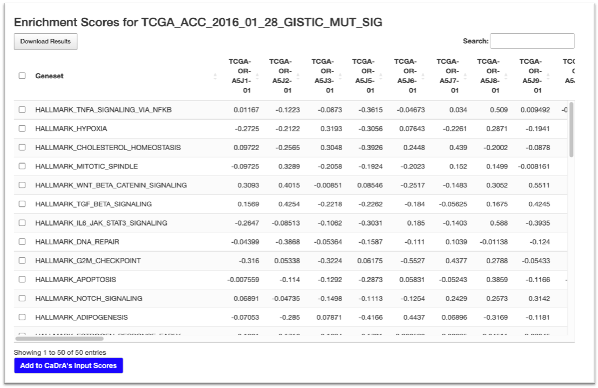

```{r, include=FALSE, messages=FALSE, warnings=FALSE}
knitr::opts_chunk$set(message=FALSE, collapse = TRUE, comment="")
```


There are two panels on this page:

- Left-side: [User Inputs](#user-inputs)
- Right-side: [GSVA Results](#gsva-results)

## 1. User Inputs


## 2. GSVA Results



